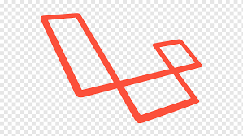
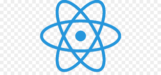

<h1 align="center">
  

  
</h1>

<p align="center">
  

  

  <a href="https://www.linkedin.com/in/lucasdeveloperti/">
    
  </a>

  <a href="https://github.com/jeffersonSantos13/Laravel_React_BoilerPlate/commits/master">
    
  </a>

  

   <a href="https://github.com/jeffersonSantos13/Laravel_React_BoilerPlate/stargazers">
    
  </a>
</p>

# Laravel + React

[](https://travis-ci.org/joemccann/dillinger)

Laravel com ReactJS.
# 🛠 Requisitos
Antes de começar, você vai precisar ter instalado em sua máquina as seguintes ferramentas:

  - PHP versão 7.0 +
  - [NPM](https://www.npmjs.com/get-npm) ou [Yarn](https://yarnpkg.com/)
  - [Composer](https://getcomposer.org/) 
  - [Git](https://git-scm.com)
  - [Node.js](https://nodejs.org/en/)
  - Além disto é bom ter um editor para trabalhar com o código como [VSCode](https://code.visualstudio.com/)

### 🧭 Rodando a aplicação

```bash
# Clone este repositório
$ git clone https://github.com/jeffersonSantos13/Laravel_React_BoilerPlate.git

# Acesse a pasta do projeto no seu terminal/cmd
$ cd Laravel_React_BoilerPlate

# Instale as dependências
$ yarn install or npm install
$ composer update

# Execute a aplicação em modo de desenvolvimento
$ php artisan serve
```

### Configurar as variáveis do Banco de Dados

```sh
DB_CONNECTION=mysql
DB_HOST=127.0.0.1
DB_PORT=3306
DB_DATABASE=laravel
DB_USERNAME=root
DB_PASSWORD=
```

### A aplicação será aberta na porta:8000

```sh
http://127.0.0.1:8000
```

